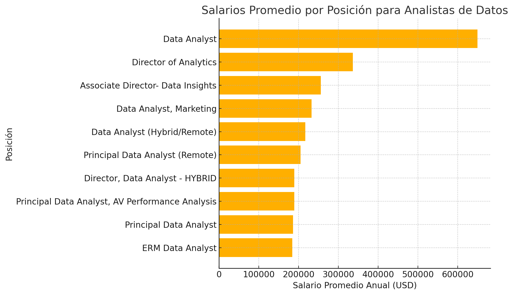

# Introducción
Explora las dinámicas del mercado laboral para analistas de datos. Este proyecto analiza las oportunidades laborales mejor remuneradas, 🔥 competencias más valoradas, 📊 la relación entre la alta demanda y los salarios competitivos en el ámbito de la analítica de datos. Además, de las compañías que más frecuentemente buscan analistas de datos y cómo los salarios de estos profesionales varían según su ubicación.

💡 Revisa los queries de este proyecto en 👉 [project_sql folder](/project_sql/) 


# Contexto
Con el propósito de aprender y practicar SQL, este proyecto se basa en una base de datos proporcionada por un tutorial educativo. La idea central es explorar el mercado laboral de los analistas de datos, identificando los trabajos mejor remunerados, las habilidades más demandadas y cómo se relacionan con los salarios competitivos. Asimismo, se amplía el análisis para incluir las empresas con mayor número de ofertas laborales y cómo varían los salarios según la ubicación, ofreciendo un panorama más completo del campo de la analítica de datos.

### Las preguntas que intenté responder a través de las queries de SQL fueron:

1. ¿Cuáles son los trabajos mejor remunerados para analistas de datos?
2. ¿Qué habilidades se requieren para estos trabajos mejor pagados?
3. ¿Cuáles son las habilidades más demandadas para analistas de datos?
4. ¿Qué habilidades están asociadas con salarios más altos?
5. ¿Cuáles son las habilidades más óptimas para aprender?
6. ¿Qué empresas publican más ofertas de trabajo para analistas de datos?
7. ¿Cómo varían los salarios para analistas de datos según la ubicación?

# Herramientas que utilicé
Para desarrollar este proyecto y explorar el mercado laboral de los analistas de datos, utilicé varias herramientas clave que aprendí a manejar a través del curso de SQL que seguí:

- **SQL:** Para consultar la base de datos y descubrir insights relevantes.
- **PostgreSQL:** El sistema de gestión elegido para el manejo de datos.
- **Visual Studio Code:** Herramienta principal para gestionar y ejecutar consultas SQL de forma eficiente.
- **Git & GitHub:** Para compartir mis scripts SQL y análisis.

# Análisis
Cada consulta de este proyecto estuvo dirigida a investigar aspectos específicos del mercado laboral para analistas de datos. Así es como se abordaron las preguntas:

### 1. Trabajos Mejor Pagados para Analistas de Datos
En esta consulta, nos enfocamos exclusivamente en trabajos remotos de analista de datos. La decisión de filtrar por trabajos remotos responde a la creciente demanda de empleos flexibles. Las posiciones se encuentran filtradas por el salario promedio anual y ubicación, exclusivamente en los trabajos remotos. El siguiente query fue empleado para resolver la pregunta:

```
SELECT
    job_id,
    job_title,
    job_location,
    job_schedule_type,
    salary_year_avg,
    job_posted_date,
    name AS company_name
FROM
    job_postings_fact
LEFT JOIN
    company_dim
ON
    job_postings_fact.company_id = company_dim.company_id
WHERE
    job_title_short = 'Data Analyst' AND
    job_location = 'Anywhere' AND
    salary_year_avg IS NOT NULL
ORDER BY
    salary_year_avg DESC
LIMIT 10;
```
Insights encontrados:
-  **Amplia gama de salarios:** El rango salarial promedio oscila entre $375,000 y $650,000 anuales. Esto resalta la competitividad de los trabajos remotos dentro del mercado.
- **Empresas líderes:** Se encuentran compañías bien establecidas  y dispuestas a atraer  talento remoto.
- **Oportunidad para el análisis comparativo:** Con este enfoque inicial, se realizara el análisis que comparen los salarios de trabajos remotos y presenciales para comprender las diferencias salariales dependiendo de la modalidad de trabajo.


*Gráfico de barras que visualiza los 10 salarios más altos para analistas de datos; ChatGPT generó este gráfico a partir de los resultados de mi consulta SQL*

### 2. ¿Qué habilidades se requieren para los trabajos mejor pagados?
Para entender qué habilidades se requieren para los trabajos mejor remunerados, uní las publicaciones de empleo mejor pagados (top_paying_jobs) con la información de las habilidades (skills), proporcionando información sobre lo que los empleadores valoran en roles de alta remuneración.

```
WITH top_paying_jobs AS (
SELECT
    job_id,
    job_title,
    job_location,
    job_schedule_type,
    salary_year_avg,
    job_posted_date,
    name AS company_name
FROM
    job_postings_fact
LEFT JOIN
    company_dim
ON
    job_postings_fact.company_id = company_dim.company_id
WHERE
    job_title_short = 'Data Analyst' AND
    job_location = 'Anywhere' AND
    salary_year_avg IS NOT NULL
ORDER BY
    salary_year_avg DESC
LIMIT 10
)

SELECT
    top_paying_jobs.*,
    skills
FROM top_paying_jobs
INNER JOIN
skills_job_dim
ON
top_paying_jobs.job_id = skills_job_dim.job_id
INNER JOIN
skills_dim 
ON 
skills_job_dim.skill_id = skills_dim.skill_id
ORDER BY
    salary_year_avg DESC;
```
Insight:

En los trabajos mejor pagados para analistas de datos, las habilidades más mencionadas son:

- **SQL (8 menciones):** Fundamental para la manipulación de datos.
- **Python (7 menciones):** Muy demandado para análisis avanzado y modelado.
- **Tableau (6 menciones):** Popular para visualización de datos.
- **R (4 menciones):** Utilizado para análisis estadístico.
- **Snowflake (3 menciones):** Herramienta en la nube para gestión de datos.

### 3. ¿Cuáles son las habilidades más demandadas para analistas de datos?
El siguiente query permitió identificar las competencias más solicitadas en las ofertas de empleo, orientando la atención hacia las áreas con mayor demanda.

```
SELECT
    skills,
    COUNT(skills_job_dim.skill_id) AS demand_count
FROM job_postings_fact
INNER JOIN skills_job_dim ON job_postings_fact.job_id = skills_job_dim.job_id
INNER JOIN skills_dim ON skills_job_dim.skill_id = skills_dim.skill_id
WHERE
    job_title_short = 'Data Analyst' AND
    job_work_from_home = 'TRUE'
GROUP BY
    skills
ORDER BY
    demand_count DESC
LIMIT 5;
```
Insight:

1. Habilidades técnicas clave: SQL lidera con 7291 menciones, seguido por Excel (4611) y Python (4330), reflejando su importancia en el análisis de datos.
2. Enfoque en herramientas de análisis: El dominio de herramientas como Tableau y Power BI también es esencial para destacarse en el campo.

| Habilidad   | Cantidad de menciones |
|-------------|------------------------|
| SQL         | 7291                 |
| Excel       | 4611                 |
| Python      | 4330                 |
| Tableau     | 3745                 |
| Power BI    | 2609                 |

*Tabla que refleja la demanda de las 5 habilidades principales en ofertas de empleo para analistas de datos*

### 4. ¿Qué habilidades están asociadas con salarios más altos?
Explorar los salarios promedio asociados con diferentes habilidades reveló cuáles son las habilidades mejor remuneradas.

```
SELECT
    skills,
    ROUND(AVG(salary_year_avg), 0) AS avg_salary
FROM job_postings_fact
INNER JOIN skills_job_dim ON job_postings_fact.job_id = skills_job_dim.job_id
INNER JOIN skills_dim ON skills_job_dim.skill_id = skills_dim.skill_id
WHERE
    job_title_short = 'Data Analyst' AND
    salary_year_avg IS NOT NULL AND
    job_work_from_home = 'TRUE'
GROUP BY
    skills
ORDER BY
    avg_salary DESC
LIMIT 25;
```
Insight:

- **Alta demanda de habilidades en Big Data y Machine Learning:**
Los salarios más altos están asociados con tecnologías de big data como PySpark y Couchbase, herramientas de machine learning como DataRobot, y bibliotecas de Python como Pandas y NumPy. Esto refleja el alto valor que la industria otorga a las capacidades de procesamiento de datos y modelos predictivos.

- **Competencia en desarrollo y despliegue de software:** El conocimiento en herramientas de desarrollo y despliegue como Bitbucket, GitLab y Kubernetes indica un cruce lucrativo entre el análisis de datos y la ingeniería, con un énfasis en habilidades que permiten la automatización y una gestión eficiente de los pipelines de datos.

- **Expertise en computación en la nube:** La familiaridad con herramientas de ingeniería de datos y nube como Databricks y GCP subraya la creciente relevancia de los entornos de análisis basados en la nube, lo que sugiere que la competencia en tecnologías cloud mejora significativamente el potencial salarial en el análisis de datos.

| Habilidad    | Salario Promedio (USD) |
|--------------|-------------------------|
| PySpark      | 208172                |
| Bitbucket    | 189155                |
| Couchbase    | 160515                |
| Watson       | 160515                |
| DataRobot    | 155486                |

*Tabla del salario promedio para las 10 habilidades mejor remuneradas para analistas de datos*

### 5. ¿Cuáles son las habilidades más óptimas para aprender?
Combinando conocimientos de los datos de demanda y salario, esta consulta tuvo como objetivo identificar habilidades que son tanto de alta demanda como bien remuneradas, ofreciendo un enfoque estratégico para el desarrollo de habilidades.

```
WITH skills_demand AS (
SELECT
    skills_dim.skill_id,
    skills_dim.skills,
    COUNT(skills_job_dim.job_id) AS demand_count
FROM job_postings_fact
INNER JOIN skills_job_dim ON job_postings_fact.job_id = skills_job_dim.job_id
INNER JOIN skills_dim ON skills_job_dim.skill_id = skills_dim.skill_id
WHERE
    job_title_short = 'Data Analyst' AND
    salary_year_avg IS NOT NULL AND
    job_work_from_home = 'TRUE'
GROUP BY
    skills_dim.skill_id
HAVING
    COUNT(skills_job_dim.job_id) > 10
), average_salary AS (
    SELECT
    skills_job_dim.skill_id,
    ROUND(AVG(salary_year_avg), 0) AS avg_salary
FROM job_postings_fact
INNER JOIN skills_job_dim ON job_postings_fact.job_id = skills_job_dim.job_id
INNER JOIN skills_dim ON skills_job_dim.skill_id = skills_dim.skill_id
WHERE
    job_title_short = 'Data Analyst' AND
    salary_year_avg IS NOT NULL AND
    job_work_from_home = 'TRUE'
GROUP BY
    skills_job_dim.skill_id
)


SELECT
    skills_demand.skill_id,
    skills_demand.skills,
    demand_count,
    avg_salary
FROM
    skills_demand
INNER JOIN
    average_salary
ON
    skills_demand.skill_id = average_salary.skill_id
ORDER BY
    avg_salary DESC,
    demand_count DESC
LIMIT 25;
```
Insight:

El análisis identifica habilidades que combinan alta demanda y altos salarios promedio para analistas de datos. Entre las principales, destacan:

- **Go:** Con 27 menciones y un salario promedio de $115320 USD, destaca en desarrollo avanzado.
- **Confluence:** Con 11 menciones y un salario de $114,210 USD, resalta en herramientas de colaboración.
- **Hadoop y Snowflake:** Altamente valoradas en big data y cloud, con salarios promedio de $113193 USD y $112948 USD respectivamente.

| Habilidad    | Demanda (# menciones) | Salario Promedio (USD) |
|--------------|------------------------|-------------------------|
| Go           | 27                     | 115320                |
| Confluence   | 11                     | 114210                |
| Hadoop       | 22                     | 113193                |
| Snowflake    | 37                     | 112948                |
| Azure        | 34                     | 111225                |

*Tabla de las habilidades más óptimas para analistas de datos ordenadas por salario*

### 6. ¿Qué empresas publican más ofertas de trabajo para analistas de datos?

Se realiza un conteo de las ofertas de trabajo publicadas por cada empresa para el rol de Data Analyst. Se muestran las 5 empresas con más ofertas.

```
SELECT
    company_dim.name,
    COUNT(job_postings_fact.job_id) AS job_count
FROM
    job_postings_fact
INNER JOIN
    company_dim
ON
    company_dim.company_id = job_postings_fact.company_id
WHERE
    job_postings_fact.job_title_short = 'Data Analyst'
GROUP BY
    company_dim.name
ORDER BY
    job_count DESC
LIMIT 5;
```

| Empresa        | Cantidad de Ofertas |
|----------------|----------------------|
| Emprego        | 1121               |
| Robert Half    | 1047               |
| Insight Global | 892                 |
| Citi           | 875                 |
| Dice           | 604                 |

*Tabla de las empresas con mayor cantidad de ofertas de trabajo para analistas de datos*

Insight:

Las empresas que más ofertas de trabajo publican para analistas de datos son Emprego (1121 ofertas) y Robert Half (1047 ofertas), seguidas por Insight Global, Citi, y Dice. Estas empresas lideran la demanda, indicando sectores con alta necesidad de análisis de datos y oportunidades laborales significativas.

### 7. ¿Cómo varían los salarios para analistas de datos según la ubicación?

El análisis de los salarios promedio para analistas de datos según la ubicación (excluyendo trabajos remotos) revela importantes variaciones. Por ejemplo:

| Ubicación                 | Salario Promedio (USD) |
|---------------------------|-------------------------|
| Belarus                   | 400000               |
| Berkeley Heights, NJ      | 200000               |
| Nea Smyrni, Greece        | 200000               |
| Hildesheim, Germany       | 200000               |
| Merced, CA                | 200000               |

*Tabla de salarios promedio por ubicación*

- Belarus lidera con un salario promedio de $400,000 USD, lo que podría indicar posiciones específicas de alta especialización o demanda localizada.
- Otras ubicaciones como Berkeley Heights, NJ y Nea Smyrni, Greece tienen salarios de $200,000 USD, destacando oportunidades internacionales competitivas.

Insight:

- **Salarios de trabajos remotos:**
Los trabajos remotos muestran un rango más amplio en los salarios, destacando posiciones como Data Analyst en Mantys con $650,000 USD anuales, significativamente más altos que los trabajos no remotos promedio.

- **Salarios de trabajos no remotos:**
Aunque el salario más alto en trabajos no remotos es en Belarus con $400,000 USD, este está considerablemente por debajo del máximo de trabajos remotos, lo que refleja una ventaja competitiva de los trabajos remotos en roles bien remunerados.

- **Relevancia de la ubicación:**
Los trabajos no remotos muestran variaciones salariales específicas basadas en la ubicación, indicando que factores como el costo de vida y la demanda local juegan un papel importante. Por otro lado, los trabajos remotos pueden ofrecer salarios más competitivos al no estar limitados por la geografía.

Esta comparación subraya el atractivo de los trabajos remotos, especialmente para roles especializados que no dependen de la presencia física en una ubicación específica.

#### Comparativa salarios remotos vs no remotos:

Insight:

- **Salarios de trabajos remotos:**
Los trabajos remotos muestran un rango más amplio en los salarios, destacando posiciones como Data Analyst en Mantys con $650,000 USD anuales, significativamente más altos que los trabajos no remotos promedio.

- **Salarios de trabajos no remotos:**
Aunque el salario más alto en trabajos no remotos es en Belarus con $400,000 USD, este está considerablemente por debajo del máximo de trabajos remotos, lo que refleja una ventaja competitiva de los trabajos remotos en roles bien remunerados.

- **Relevancia de la ubicación:**
Los trabajos no remotos muestran variaciones salariales específicas basadas en la ubicación, indicando que factores como el costo de vida y la demanda local juegan un papel importante. Por otro lado, los trabajos remotos pueden ofrecer salarios más competitivos al no estar limitados por la geografía.


**Salarios de Trabajos Remotos**

| Posición                          | Salario Promedio (USD) |
|-----------------------------------|-------------------------|
| Data Analyst (Mantys)             | 650000               |
| Director of Analytics (Meta)      | 336500               |
| Associate Director- Data Insights | 255830               |
| Data Analyst, Marketing           | 232423               |
| Data Analyst (Hybrid/Remote)      | 217000               |

*Tabla de salarios promedio trabajo remoto*

**Salarios de Trabajos no Remotos**

| Ubicación                 | Salario Promedio (USD) |
|---------------------------|-------------------------|
| Belarus                   | 400000               |
| Berkeley Heights, NJ      | 200000               |
| Nea Smyrni, Greece        | 200000               |
| Hildesheim, Germany       | 200000               |
| Merced, CA                | 200000               |

*Tabla de salarios promedio por ubicación*

Esta comparación subraya el atractivo de los trabajos remotos, especialmente para roles especializados que no dependen de la presencia física en una ubicación específica.

Las queries usadas para responder a esta pregunta fueron:

```
--- Para los trabajos no remotos
SELECT
    job_location,
    ROUND(AVG(salary_year_avg)) AS avg_salary
FROM
    job_postings_fact
WHERE
    job_location <> 'Anywhere'
    AND salary_year_avg IS NOT NULL
    AND job_title_short = 'Data Analyst'
GROUP BY
    job_location
ORDER BY
    avg_salary DESC
LIMIT 10;
```
```
--- Para el caso de trabaajos remotos
SELECT
    job_id,
    job_title,
    job_location,
    job_schedule_type,
    salary_year_avg,
    job_posted_date,
    name AS company_name
FROM
    job_postings_fact
LEFT JOIN
    company_dim
ON
    job_postings_fact.company_id = company_dim.company_id
WHERE
    job_title_short = 'Data Analyst' AND
    job_location = 'Anywhere' AND
    salary_year_avg IS NOT NULL
ORDER BY
    salary_year_avg DESC
LIMIT 5;
```


# Lo que aprendí 
A lo largo de esta experiencia, he fortalecido significativamente mis habilidades en SQL y análisis de datos:

🛠️ **Dominio de Bases de Datos:** Aprendí a manejar y cargar bases de datos eficientemente, además de utilizar herramientas como PostgreSQL para gestionar datos de manera profesional.

🧩 **Creación Avanzada de Consultas:** Mejoré en la construcción de queries y subqueries complejas, incluyendo el uso de WITH para crear tablas temporales y simplificar análisis detallados.

💡 **Investigación Basada en Preguntas:** Descubrí que la clave para un análisis exitoso comienza con formular las preguntas correctas. Esto me permitió definir con claridad los objetivos de cada consulta y extraer información útil de los datos.


# Conclusiones
**1. Trabajos mejor remunerados para analistas de datos:** Los trabajos remotos para analistas de datos ofrecen salarios significativamente más altos que los trabajos presenciales. Esto subraya el atractivo de roles flexibles que no están limitados geográficamente, con empresas líderes como Mantys y Meta liderando la oferta salarial.

**2. Habilidades requeridas** Los trabajos mejor remunerados valoran habilidades técnicas clave como SQL, Python y Tableau. Estas competencias son fundamentales para la manipulación, análisis y visualización de datos, mostrando la importancia de herramientas avanzadas para roles bien remunerados.

**3. Habilidades más demandadas para analistas de datos** SQL, Excel y Python lideran la lista de habilidades más solicitadas, reflejando su importancia en el análisis de datos y la resolución de problemas empresariales. Además, herramientas como Tableau y Power BI destacan como esenciales para la visualización y presentación de datos.

**4. Habilidades están asociadas con salarios más altos** Habilidades como PySpark, Couchbase y DataRobot están altamente asociadas con salarios competitivos. Esto refleja la alta demanda de tecnologías avanzadas en Big Data, machine learning y procesamiento de datos en la nube.

**5. Habilidades más óptimas para aprender** Las habilidades que combinan alta demanda y salarios elevados incluyen Go, Confluence, Hadoop y Snowflake. Esto sugiere que invertir en estas competencias puede ser estratégico para mejorar la empleabilidad y maximizar el potencial salarial.

**6. Qué empresas con más ofertas para analistas de datos** Empresas como Emprego, Robert Half y Insight Global lideran la publicación de ofertas laborales para analistas de datos. Esto indica sectores que tienen una alta demanda de profesionales de datos, ofreciendo una ventana para identificar posibles empleadores clave.

**7. Variación de los salarios para AD según ubicación** Los salarios de trabajos presenciales varían significativamente por ubicación, con Belarus liderando con $400,000 USD. Sin embargo, los trabajos remotos ofrecen salarios más altos en promedio, lo que evidencia el impacto de la flexibilidad laboral en la competitividad salarial.

## Reflexiones finales
Este proyecto no solo me permitió mejorar significativamente mis habilidades en SQL, sino que también me ofreció una perspectiva valiosa sobre el mercado laboral para analistas de datos. Me siento satisfecha y emocionada por haber concluido este trabajo, que no solo refleja el esfuerzo invertido, sino también mi capacidad para analizar y entender información valiosa que brinda la data.

 Este proyecto reafirma la importancia de un aprendizaje continuo y la adaptabilidad a las tendencias emergentes en el campo de la analítica de datos, abriendo la puerta a nuevas oportunidades en mi carrera.